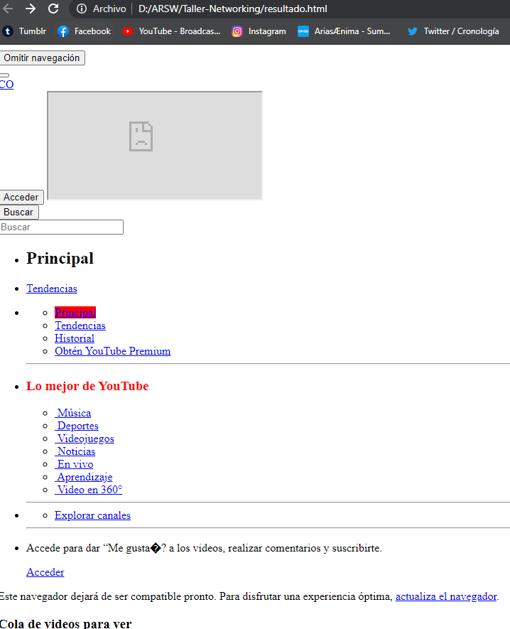

# Taller Networking

Es una implementación simple de un web server utilizando sockets, actualmente puede "servir" archivos de Imagenes y Texto (png, jpg, css, js, html).

## Autor

* **J. Eduardo Arias Barrera** - [AriasAEnima](https://github.com/AriasAEnima)


## Rendimiento LOC/h

1. Desde las 11:00 , hasta las 20:00 (con un receso de 1 hr)  fueron aprox 350 lineas
1. Desde las 10:00 , hasta las 12:00 

LOC=33 LOC/h

### Prerrequisitos

Java JDK 1.8, Maven y Git.

* [JAVA JDK 8](http://www.oracle.com/technetwork/java/javase/overview/index.html) - Version de Java
* [Maven](https://maven.apache.org/) - Maven


## Para empezar

Se debe ejecutar en la carpeta que queremos que esté
```
> git clone https://github.com/AriasAEnima/taller-networking.gitt
```
### Instalación

Primero ejecutamos maven en la carpeta raiz, esto compilara el aplicativo

```
> mvn package
```

## Ejecución y Desarrollo:

Para correr los diferentes servidores utilizaremos los comandos indicados:

### 1) Ejercicio Guardar Html en un archivo (Browser):

El archivo quedara en la raíz como resultado.html
```
java -cp target/Taller-Networking-1.0-SNAPSHOT.jar edu.escuelaing.arsw.networking.Browser https://www.youtube.com/
```


#### Código del Server:


### 2) Ejercicio devolver ^2 de un numero:
```
java -cp target/Taller-Networking-1.0-SNAPSHOT.jar edu.escuelaing.arsw.square.EchoServerSquare
```
y en otra terminal
```
java -cp target/Taller-Networking-1.0-SNAPSHOT.jar edu.escuelaing.arsw.square.EchoClientSquare
```


#### Código del Server:


### 3) Ejercicio funciones trigonométricas:
```
java -cp target/Taller-Networking-1.0-SNAPSHOT.jar edu.escuelaing.arsw.function.EchoServerFunction
```
y otro con :

```
java -cp target/Taller-Networking-1.0-SNAPSHOT.jar edu.escuelaing.arsw.function.EchoClientFunction
```


#### Código del Server:


## Ejecicio HttpServer

Ejecutamos este comando y podremos probar con nuestro explorador que sucede.

```
java -cp target/Taller-Networking-1.0-SNAPSHOT.jar edu.escuelaing.arsw.http.EchoServerHttp
```


## Diseño Utilizado


Podríamos decir que un acercamiento a un patron de fabrica simplificado, donde quien toma tiene la inteligencia de escoger (y retornar) el writer concreto es <ResourceChooser> utilice un map para utilizarlo como si fuera un switch en el código.

Aqui vemos los archivos soportados y sus equivalencias en Writers:


Esta implementación nos permite agregar mas ResourceWriters , lo agregamos en el map de Chooser y EchoServerHttp seguirá funcionando a la perfección.


### Pruebas especificas
Hice dos pruebas:
### 1) Escribí un código html, js y agregué una imagen.
Ingresamos la URL
```
> localhost:35000/prueba/index.html
```
Como podemos ver pide 3 recursos.


Y pide un cuarto que no implementamos


### 2) Descargue un paquete completo de una Pagina Web y mire que tal lo mostraba.

Ingresamos la URL
```
> localhost:35000/index.html
```

Como podemos ver pide muchos recursos.


## Documentación:

Se encuentra en la carpeta
```
> cd src/resources
```

## Bibliografía

Simple web server en java utilizando sockets. (2017, 7 noviembre). Recuperado 9 de junio de 2020, de https://kriversia.com/2017/08/simple-web-server-java/amp


## Licencia

This project is licensed under the MIT License  - see the [LICENSE](LICENSE) file for details
